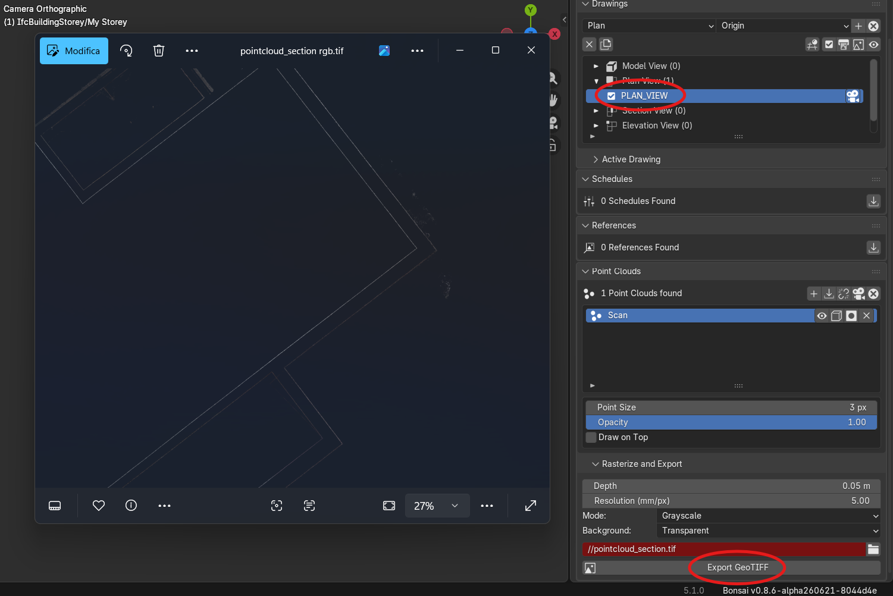

# Bonsai Point Clouds

Integration between **Bonsai** (IFC models in Blender) and **Point Cloud Visualizer** (Jakub Uhlík).

It loads point clouds referenced from the IFC model, positions them, and manages a clip box for clipping in Blender — with a built-in GPU fallback viewer when PCV is not installed.

## Demo


## GeoTIFF Export



Export a georeferenced raster from the active orthographic view — useful for overlaying point cloud density maps onto drawings or GIS tools. The panel (under **Reference and Export**) lets you set depth, mode (Grayscale / RGB), and background (Black / White / Transparent).

## Features

- ✅ Dedicated **Point Clouds** panel in Bonsai's "Drawings and Documents" tab
- ✅ Load point clouds via PCV (PLY, LAS, LAZ, E57) or the built-in viewer (PLY)
- ✅ Persistent host object in the IFC (IfcAnnotation + placement), reloadable in position
- ✅ Clip box (3 m cube) driving PCV clipping; select/show operator
- ✅ Show/hide via PCV erase (not object hiding)
- ✅ Undo/redo through Bonsai transactions
- ✅ Standard IFC entities only — no custom property set

## Requirements

- Blender 4.0+
- Bonsai add-on
- Point Cloud Visualizer (v3+) — **optional** (see below)

## Visualization backend

The add-on uses one of two backends, chosen automatically:

| | With **Point Cloud Visualizer** | Without PCV (built-in viewer) |
|---|---|---|
| Formats | PLY, LAS, LAZ, E57 | **PLY only** |
| Rendering / performance | full GPU shader, large clouds | minimal GPU viewer (preview) |
| **Clipping** (clip box) | ✅ | ❌ not available |
| Per-point colors | ✅ | only if the PLY contains colors |

The built-in viewer is a fallback so you are not left empty-handed when PCV is missing. **For the full experience, Point Cloud Visualizer is strongly recommended.**

## ⭐ Recommended: Point Cloud Visualizer (Jakub Uhlík)

This add-on **does not bundle or replace** Point Cloud Visualizer: it only drives it, when present, through its public API. PCV is an excellent product developed and maintained by **Jakub Uhlík** — if you use it in your work, support the author by buying the official version:

➡️ **[Point Cloud Visualizer on Superhive Market](https://superhivemarket.com/products/pcv)**

Buying it gives you all formats, performance on massive clouds and clipping, and supports the ongoing development of the tool.

## Installation

1. Clone the repository:
   ```bash
   git clone https://github.com/carlopav/bonsai_pointclouds.git
   ```
2. Install the add-on in Blender from `src/bonsai_pointclouds` (e.g. zip that folder and use Edit > Preferences > Add-ons > Install from Disk, or symlink/junction it into your Blender `scripts/addons`).
3. Restart Blender and enable the add-on.
4. The **Point Clouds** panel appears in Properties > Scene > **Drawings and Documents**.

## Module architecture

Follows the Bonsai module pattern (core/tool/data separation):

```
src/bonsai_pointclouds/
├── __init__.py    # bl_info, class registration + props + refresh handler
├── const.py       # naming, IFC schema, PCV/viewer constants
├── prop.py        # PropertyGroups (PointCloud, BIMPointCloudProperties)
├── data.py        # PointCloudsData (IFC-derived cache for the UI)
├── tool.py        # PointCloud (implementation: IFC via ifcopenshell.api, PCV, Blender)
├── core.py        # pure logic (no bpy), orchestrates the tool
├── operator.py    # thin operators; IFC ones use tool.Ifc.Operator (_execute)
├── ui.py          # BIM_PT_point_clouds (child of BIM_PT_tab_drawings) + BIM_UL_point_clouds
└── viewer.py      # built-in GPU fallback viewer + PLY reader
```

## Usage

1. In the panel, click the **import** icon to load the referenced clouds, then **+** to add one (file dialog PLY/LAS/LAZ/E57).
2. Select a cloud and click **Load** (top, next to Add) to display it in the viewport.
3. Per cloud in the list: **visibility**, **create/select clip box**, **enable/disable clipping** (PCV only), **remove**.

## Data architecture (persistent in the IFC)

Each cloud uses **standard IFC entities only** (no custom pset):
- **IfcAnnotation** (`ObjectType = "PointCloud"`) — placeholder with `IfcObjectPlacement` (persistent position; Blender object named `PointCloud/...`).
- **IfcDocumentReference** (via `IfcRelAssociatesDocument`) — file path in `Location`; named `POINTCLOUD_...`.
- **IfcDocumentInformation.CreationTime** — import date.

Session-only state (NOT persisted): visibility (PCV erase / viewer draw flag) and clipping (the clip box is a 3 m Blender-only cube).

All writes go through `ifcopenshell.api` (`root.create_entity`, `document.add_information`/`add_reference`/`assign_document`, `geometry.edit_object_placement`), so ownership history and undo/redo are handled by Bonsai.

## Technical notes

- IFC mutations (add/remove) go through `tool.Ifc.Operator` → automatic undo/redo.
- The UI reads from `data.py` (cache invalidated by handlers on undo/redo/load).
- The host object is linked to the IfcAnnotation (`tool.Ifc.link`) → Bonsai persists its placement; the clip box is session-only.
- Visibility via PCV: the `draw` flag in `PCVMechanist.cache` (erase), not object hiding.
- PCV API: load `PCVStoker.load()` + `PCVMechanist`, clip via `shader.clip_planes_from_bbox_object`.
- Built-in viewer (`viewer.py`): a single `SpaceView3D` draw handler draws a `POINTS` batch (Blender's `FLAT_COLOR` shader) per cloud using the host's `matrix_world`; points/colors are parsed from PLY into NumPy.

## TODO

- [x] Clip via PCV: `shader.clip_planes_from_bbox_object` + `..._live` + `clip_enabled`
- [x] Visibility via PCV erase; clip box = 3 m cube; select/show clip box
- [x] Bonsai-standard refactor (core/tool/data/operator/prop/ui), standard IFC entities only
- [x] Persistent host (IfcAnnotation + placement) reloadable in position
- [x] Built-in GPU fallback for PLY when PCV is not installed (viewer.py)
- [x] Align clip box to the active drawing view (extent + shallow depth slab)
- [ ] Migrate to the PCV 3.8 public API (`pcv.draw_file` / `draw` / `erase` / `properties`) instead of internal `PCVStoker`/`PCVMechanist`
- [ ] Built-in clip box for the GPU viewer (minimal clipping without PCV)
- [ ] Test coverage for the `core` logic
- [ ] Georeference offset handling (optional — many survey clouds use a local frame)
- [ ] Support for ASCII formats (XYZ, PTS)

### Toward an upstream Bonsai PR

- [ ] Make the free GPU viewer the primary backend (PCV optional acceleration), incl. clipping
- [ ] Tests on the `core` modules
- [ ] Optional georeference/false-origin support

## License

GPL v3 (compatible with the Blender ecosystem)

## Credits

- **Point Cloud Visualizer** by Jakub Uhlík — [buy on Superhive Market](https://superhivemarket.com/products/pcv)
- **Bonsai** by IfcOpenShell & community
